  <picture>
    <source media="(prefers-color-scheme: dark)" srcset="dark.svg">
    <source media="(prefers-color-scheme: light)" srcset="light.svg">
    
  </picture>

---

### About Me

AI Engineer with 6+ years of experience in data management.  
Focused on building practical AI systems, data science workflows, and machine learning solutions using Python and Scikit-learn.

**Location:** Pakistan  
**Focus:** AI Systems · Data Science · Machine Learning  
**Core Stack:** Python · Scikit-learn · Pandas · NumPy · SQL

---

### Skills

`Python` `Scikit-learn` `Pandas` `NumPy` `Matplotlib` `Seaborn` `SQL` `Git` `Data Management`

---

  <a href="https://github.com/AdnanRaza88">GitHub</a> ·
  LinkedIn ·
  Portfolio

