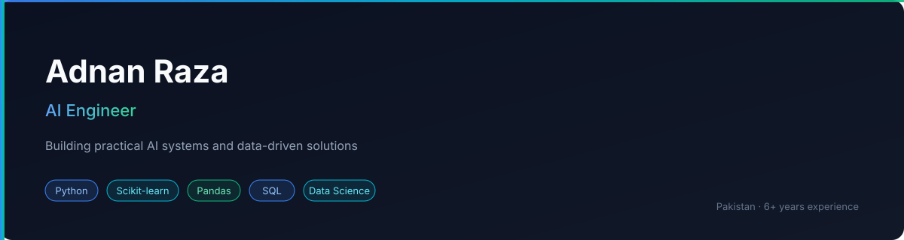

  

 

  
  
  
  
  

---

### 👋 About Me

AI Engineer with **6+ years** of experience in data management and analytics.  
Focused on building practical machine learning systems, data pipelines, and intelligent applications using Python.

**Core Focus**  
🤖 AI Systems · 🧠 Machine Learning · 📊 Data Science · 📈 Analytics

---

### 🛠️ Tech Stack

---

### 💼 Experience Highlights

- 6+ years working with large-scale data systems and analytics workflows
- Building end-to-end ML solutions from data preprocessing to model deployment
- Strong foundation in classical machine learning and data science tooling
- Comfortable owning problems from understanding requirements to delivery
- Experience with RAG systems, LangChain, Groq LLMs and Streamlit apps

---

### 📌 Featured Projects

| Project | Description | Tech |
|---------|-------------|------|
| [e9](https://github.com/AdnanRaza88/e9) | Lab Report Rubric Scorer with specialist AI agents | Python, AI |
| [pdf-rag-chatbot](https://github.com/AdnanRaza88/pdf-rag-chatbot) | PDF RAG Chatbot (LangChain + FastAPI + Streamlit) | Python, RAG |
| [GradePulse-Academic-Tracker](https://github.com/AdnanRaza88/GradePulse-Academic-Tracker) | Full Stack AI-Powered Student Grade Tracker | FastAPI, Streamlit, Groq |
| [AI-Fitness-Coach](https://github.com/AdnanRaza88/AI-Fitness-Coach) | AI-powered Fitness Coach application | Python, AI |
| [loan-risk-analyzer](https://github.com/AdnanRaza88/loan-risk-analyzer) | Streamlit Loan Application Risk Analyzer | LangChain, Groq |
| [Heart_diseases_app](https://github.com/AdnanRaza88/Heart_diseases_app) | Heart Disease Prediction Web App | Python, ML |

---

### 📊 GitHub Stats

  
  

 

  

---

### 🔗 Connect with Me

---

  

  <i>Building practical AI one project at a time 🚀</i>

