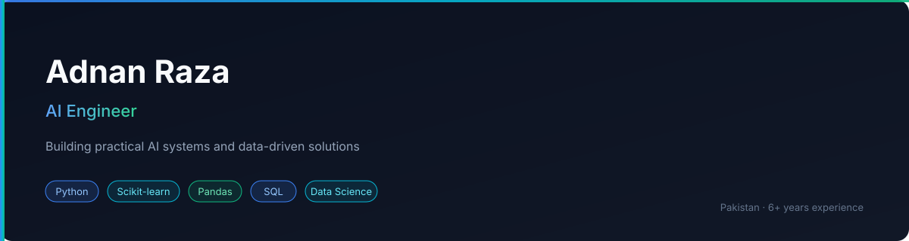

  

 

  <h1>Adnan Raza</h1>
  <h3>AI Engineer · GenAI Developer · Multi-Agent Systems</h3>
  
Building production-ready RAG pipelines, multi-agent systems, and AI automation

---

### About Me

- Building RAG pipelines, hierarchical multi-agent systems (LangGraph), and AI automation workflows
- Open to collaborate on Generative AI, agentic coding systems, RAG platforms, and production AI tools
- Exploring advanced multi-agent orchestration, MCP integrations, and local-first AI systems
- Ask me about LangChain, LangGraph, RAG, FastAPI, Streamlit, n8n, vector databases, and AI agents
- Fun fact: Turned 6+ years of data management experience into shipping full-stack AI products end-to-end

---

### Socials

---

### Tech Stack

---

### GitHub Stats

  
  

  

---

### Featured Projects

| Project | Description |
|---------|-------------|
| [Helix](https://github.com/AdnanRaza88/Helix) | GitHub command surface — natural-language ops for repos, issues, PRs & multi-agent coding |
| [AgentForge](https://github.com/AdnanRaza88/AgentForge) | Open-source terminal-first AI coding agent (multi-provider, skills, CLI + web) |
| [claude-code-replica](https://github.com/AdnanRaza88/claude-code-replica) | Hierarchical multi-agent workspace inspired by Claude Code style domains |
| [hr-voice-ai-platform](https://github.com/AdnanRaza88/hr-voice-ai-platform) | Local-first multi-agent HR Voice AI: screening, agentic RAG, employee panels |
| [towelworks-factory](https://github.com/AdnanRaza88/towelworks-factory) | Offline Android factory workforce & overlock production manager (APK via Actions) |
| [social-media-post](https://github.com/AdnanRaza88/social-media-post) | Relay — 24/7 social desk: transcribe, SEO, post & auto-reply across platforms |
| [rag-os](https://github.com/AdnanRaza88/rag-os) | Self-hosted, privacy-first enterprise RAG & live-data knowledge platform |
| [e9-lab](https://github.com/AdnanRaza88/e9-lab) | Lab Report Rubric Scorer — evidence-backed grading with specialist AI agents |
| [GitHub-Agent](https://github.com/AdnanRaza88/GitHub-Agent) | Streamlit GitHub coding agent with Grok & multi-provider natural language control |
| [AetherForge](https://github.com/AdnanRaza88/AetherForge) | Autonomous hierarchical multi-agent coding system (spec-driven, local-first) |

---

  

  <b>Open to full-time roles in AI Engineering, Generative AI, and Multi-Agent Systems</b>

